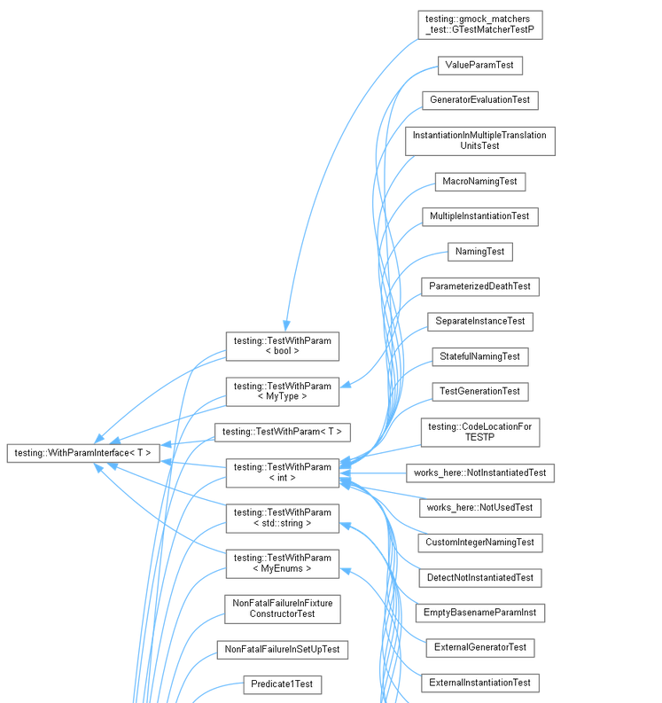

# doxydoc



The script is aimed to generate Doxygen documentation along with call-by/called-by graphs and UML class diagrams for C/C++ projects.

Although it already has all the presets for the configuration process, one can change the configuration via [doxywizard](https://www.doxygen.nl/manual/doxywizard_usage.html) which is being installed via the standard Doxygen installer on Windows and has to be separatelly installed running `sudo apt install doxygen-gui` on Linux. After the improvements are made, place the content of the resulting configuration file inside the script to a dedicated variable, you will quickly notice it.

For UML class diagrams a [graphviz](https://graphviz.org/) package is required to be installed. The result of the generation is a set of HTML pages.

Open an _index.html_ page in order to start browsing.

# prerequirements

- [python](https://www.python.org/downloads/) (obviously)
- [doxygen](https://doxygen.nl/)
- [graphviz](https://graphviz.org/)

## linux prerequirements installation
Just execute the following command:
```
sudo apt install -y doxygen graphviz
```

## windows prerequirements installation
Download installers from official websites and run the installation process.

After installing _doxygen_ and _graphviz_ on Windows it is required to add them to the _PATH_ system environment variable so that they can be reachable from the command line.

# usage

To run tbe script it is required to indicate the path to a source code for which the Doxygen documentation shall be generated. Indicate the source path with the `--source` flag:
```
python3 doxydoc.py --source /path/to/source/
```

By default, the destination folder is set to the current working directory of the script file, e.g. /path/to/destination/=cwd. If you need to change it, provide the desired destination path with the `--destination` flag:
```
python3 doxydoc.py --source /path/to/source/ --destination /path/to/destination/
```

Sometimes it is required to skip some folders (e.g. build folders) in the source path. For that specify these folders relatively (!) to the source path with the `--exclude` flag:
```
python3 doxydoc.py --source /path/to/source/ --exclude folder1 folderN
```
By _relatively_ means, that _folder1_ ... _folderN_ are being placed inside _/path/to/source/_, so no use in full path indication for them.

# hacks
Most projects are big and the process of opening the result folder via file manager may take a while. It is recommended to open the resulting _index.html_ file via command line:
```
cd /path/to/destination/project_name/html/
firefox index.html
```

All commands also have short aliases.

There is an instruction of usage inside script, just specify `--help` flag:
```
python3 doxydoc.py --help
```
